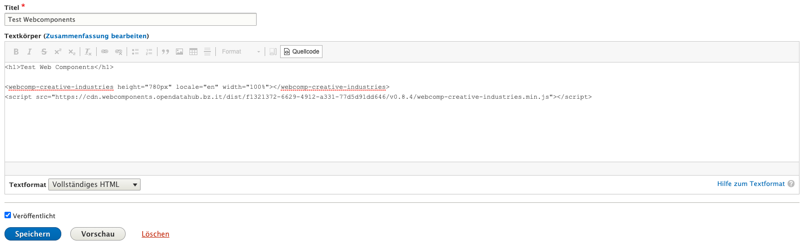

<!--
SPDX-FileCopyrightText: NOI Techpark <digital@noi.bz.it>

SPDX-License-Identifier: CC0-1.0
-->

Drupal
=======

## Table of contents
- [Local setup with Docker](local-setup-with-docker)
- [How to add a web-component](how-to-add-a-web-component)

## Local setup with Docker

The project conains a docker compose file that will setup a fresh drupal instance.

```sh
docker-compose up -d
```

To see the running Drupal installation click on the link below:

http://localhost:8080

## How to add a web-component

Go into the edit mode of your page and select **Textformat: Full HTML**.



Click on **Source Code**.

Paste the web component code into the text area, save and preview the changes.

```html
<webcomp-creative-industries height="780px" locale="en" width="100%"></webcomp-creative-industries>

<script src="https://cdn.webcomponents.opendatahub.bz.it/dist/f1321372-6629-4912-a331-77d5d91dd646/v0.8.4/webcomp-creative-industries.min.js"></script>
```
