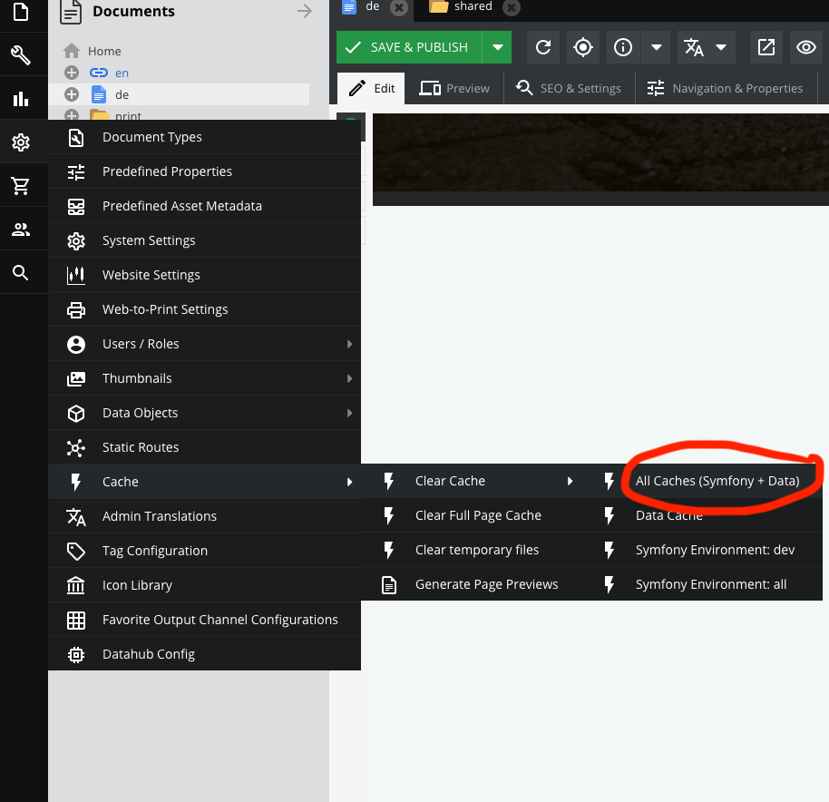
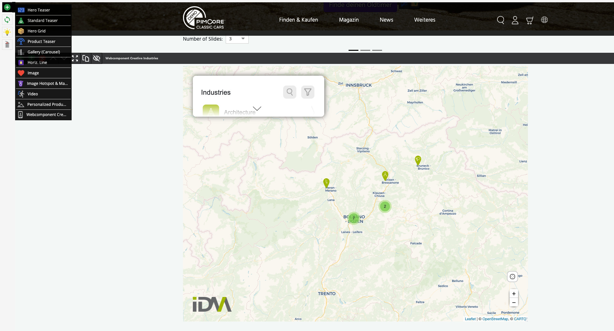

Pimcore
=======

## Table of contents
- [Local setup with Docker](local-setup-with-docker)
- [How to add a web-component](how-to-add-a-web-component)

## Local setup with Docker

Follow the official guide: https://github.com/pimcore/demo

## How to add a web-component

All you have to do is create your own [Brick](https://pimcore.com/docs/6.x/Development_Documentation/Documents/Editables/Areablock/Bricks.html) and reference it in the template of your document.

### Create the template file

```bash
cd Resources/views/Areas
mkdir webcomp-creative-industries
cd webcomp-creative-industries
touch view.html.twig
```

For example copy this html content into the newly created `view.html.twig` file.

```html
<section class="container">
    <webcomp-creative-industries locale="en" width="1050px" height="780px"></webcomp-creative-industries>
    <script src="https://cdn.webcomponents.opendatahub.bz.it/dist/f1321372-6629-4912-a331-77d5d91dd646/v0.8.4/webcomp-creative-industries.min.js"></script>
<section class="container">
```

### Create the Areabrick class

```bash
cd src/AppBundle/Document/Areabrick
touch WebcompCreativeIndustries.php
```

Copy the following content into the newly created file `WebcompCreativeIndustries.php`.

```php
<?php

namespace AppBundle\Document\Areabrick;

class WebcompCreativeIndustries extends AbstractAreabrick
{
    /**
     * {@inheritdoc}
     */
    public function getName()
    {
        return 'Webcomponent Creative Industries';
    }
}
```

### Add the newly created "brick" in your layout file

In the demo example you can find the file `app/Resources/views/content/portal.html.twig`. This template is used in the index page of the demo project.

```php



    {#Hero caraousel#}
    {{ include('includes/hero-carousel.html.twig') }}

    <div id="portal" class="portal-page">
        {{ pimcore_areablock('content', {
            'allowed': ['hero-teaser', 'standard-teaser', 'hero-grid', 'product-teaser', 'gallery-carousel', 'horizontal-line', 'image', 'image-hotspot-marker', 'video', 'personalized-product-teaser', 'webcomp-creative-industries', 'horizontal-line']
        }) }}
    </div>

```

You have to add `webcomp-creative-industries` to the array of allowed bricks.

### Refresh the cache

Refresh all caches by clicking on the link "All Caches (Symfony & Data)"



### Select webcomponent brick in page

Navigate to your page and now you should be able to select the newly created brick (webcomponent) from the list of possible areas.


