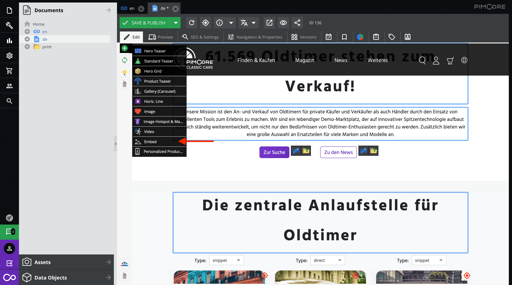
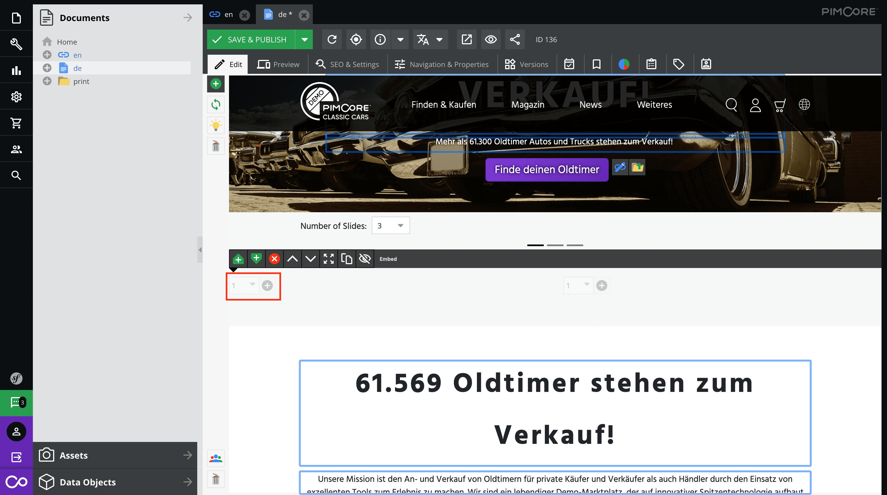
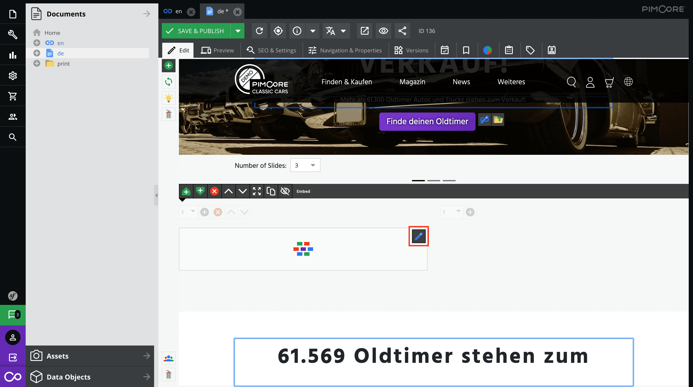

<!--
SPDX-FileCopyrightText: NOI Techpark <digital@noi.bz.it>

SPDX-License-Identifier: CC0-1.0
-->

Pimcore
=======

## Table of contents
- [Local setup with Docker](local-setup-with-docker)
- [How to add a web-component with the embed brick](how-to-add-a-web-component-with-the-embed-brick)
- [How to add a web-component as your own brick](how-to-add-a-web-component-as-your-own-brick)

## Local setup with Docker

Follow the official guide: https://github.com/pimcore/demo

## How to add a web-component with the embed brick

To quickly and easily add a web component to a Pimcore website you can also use an .[Embed Brick](https://pimcore.com/docs/pimcore/current/Development_Documentation/Documents/Editables/Embed.html).

1. Activate the embed brick in your template by adding it to the allowed bricks.
   
   ```twig
   
   
   
       {{ include('includes/hero-carousel.html.twig') }}
       <div id="portal" class="portal-page">
           {{ pimcore_areablock('content', {
               'allowed': ['hero-teaser', 'standard-teaser', 'hero-grid', 'product-teaser', 'gallery-carousel', 'horizontal-line', 'image', 'image-hotspot-marker', 'video', 'embed', 'personalized-product-teaser']
           }) }}
       </div>
   
   ```

2. And that's all you need to do in the code. Now you can simply select the embed brick on the edit page in the admin area and pull it into your layout.
   
   

3. If you have added an embed brick you can now add a new element. Just click on one of the two add buttons.
   
   

4. To add the desired web component just click on the edit button in the placeholder you just created. An popup will appear. Just enter the code of the web component and click OK. 
   
   

5. And you are done

## How to add a web-component as your own brick

All you have to do is create your own [Brick](https://pimcore.com/docs/6.x/Development_Documentation/Documents/Editables/Areablock/Bricks.html) and reference it in the template of your document.

1. Create the template file

```bash
cd Resources/views/Areas
mkdir webcomp-creative-industries
cd webcomp-creative-industries
touch view.html.twig
```

For example copy this html content into the newly created `view.html.twig` file.

```html
<section class="container">
    <webcomp-creative-industries locale="en" width="1050px" height="780px"></webcomp-creative-industries>
    <script src="https://cdn.webcomponents.opendatahub.com/dist/f1321372-6629-4912-a331-77d5d91dd646/v0.8.4/webcomp-creative-industries.min.js"></script>
<section class="container">
```

2. Create the Areabrick class

```bash
cd src/AppBundle/Document/Areabrick
touch WebcompCreativeIndustries.php
```

Copy the following content into the newly created file `WebcompCreativeIndustries.php`.

```php
<?php

namespace AppBundle\Document\Areabrick;

class WebcompCreativeIndustries extends AbstractAreabrick
{
    /**
     * {@inheritdoc}
     */
    public function getName()
    {
        return 'Webcomponent Creative Industries';
    }
}
```

### Add the newly created "brick" in your layout file

In the demo example you can find the file `app/Resources/views/content/portal.html.twig`. This template is used in the index page of the demo project.

```php



    {#Hero caraousel#}
    {{ include('includes/hero-carousel.html.twig') }}

    <div id="portal" class="portal-page">
        {{ pimcore_areablock('content', {
            'allowed': ['hero-teaser', 'standard-teaser', 'hero-grid', 'product-teaser', 'gallery-carousel', 'horizontal-line', 'image', 'image-hotspot-marker', 'video', 'personalized-product-teaser', 'webcomp-creative-industries', 'horizontal-line']
        }) }}
    </div>

```

You have to add `webcomp-creative-industries` to the array of allowed bricks.

3. Refresh the cache

Refresh all caches by clicking on the link "All Caches (Symfony & Data)"


4. Select webcomponent brick in page

Navigate to your page and now you should be able to select the newly created brick (webcomponent) from the list of possible areas.


