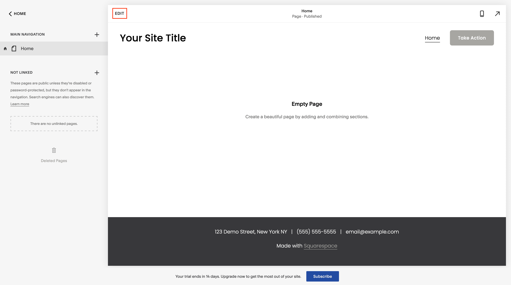
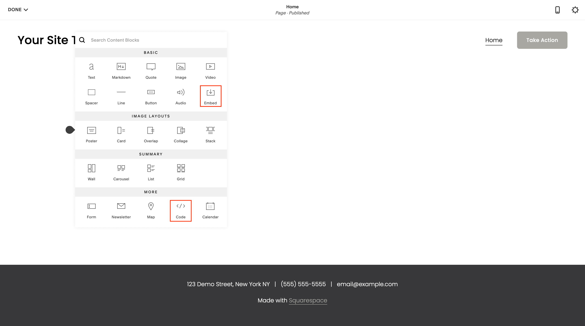
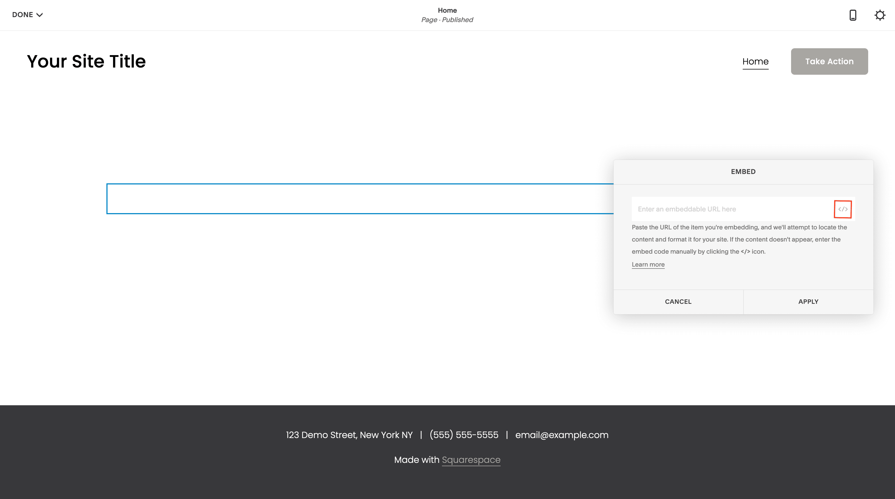
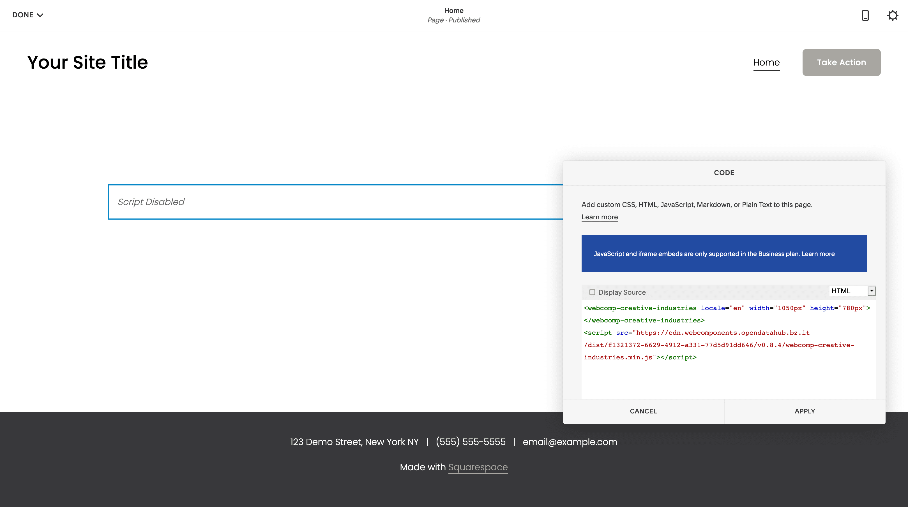

Squarespace
====================================

## Table of contents
- [Prerequisites](prerequisites)
- [How to add web components](how-to-add-web-components)

## Prerequisites

In order for web components to work in Squarespace you need a business account, otherwise Javascript is disabled on your site.

## How to add web components

1. Enter the edit mode on the page where you want to add web components.
   
   

2. If you don't have a top level element where you want to add the web component, just create a new one. 

3. If you do not have a top-level element to which you want to add the Web Component, simply create a new element, otherwise just use the existing one.

4. In top level element insert a new block. There are two possibilities to integrate external components. The embed block or the code block. 
   
   
   
   - The Embed block works quite simply. After you insert it, you just have to click on the code symbol and insert the code of the web component
     
     
   
   - The code block works similarly. Only that here you only have to insert it and paste the code. Please make sure that you do not check the "Display source" checkbox, otherwise only the source code is displayed
     
     

5. Now you' re done. Please note that the web components are only shown if you have a Business account, otherwise JavaScript and CSS are disabled.
