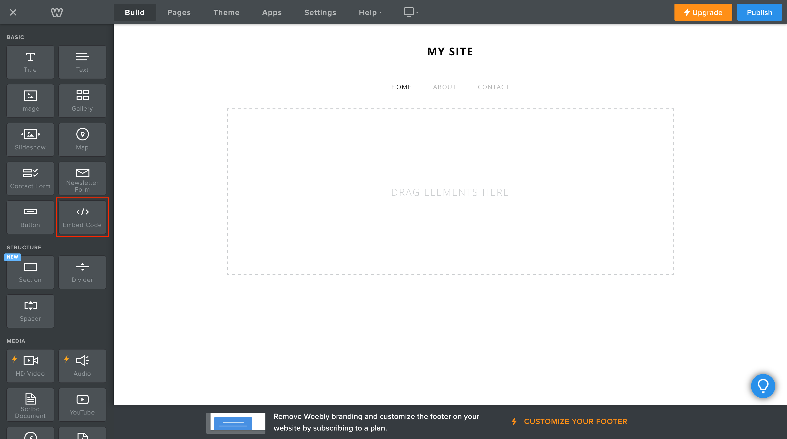

# Weebply

## Table of contents

- [Prerequisites](prerequisites)
- [How to add web components](how-to-add-web-components)

## Prerequisites

Adding Web Components to Weebly is very straightforward. To follow this guide you will need a Weebly account.

## How to add web components

1. Login to your Weebly account and create a new website. Alternatively you can use an existing one. 

2. Use the "Embed Code" element and drag it to the desired section.
   
   

3. Click on the "Embed Code" element. A popup with some settings will open. Click on "Edit Custom HTML".
   
   

4. Paste the snippet of the web component into the text field and you are done.
   
   
