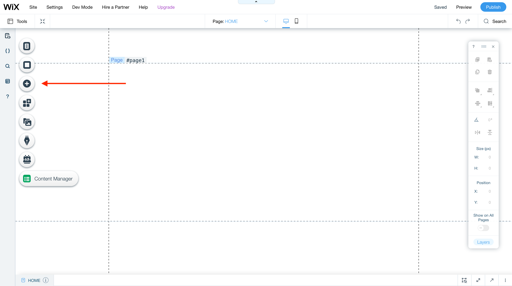
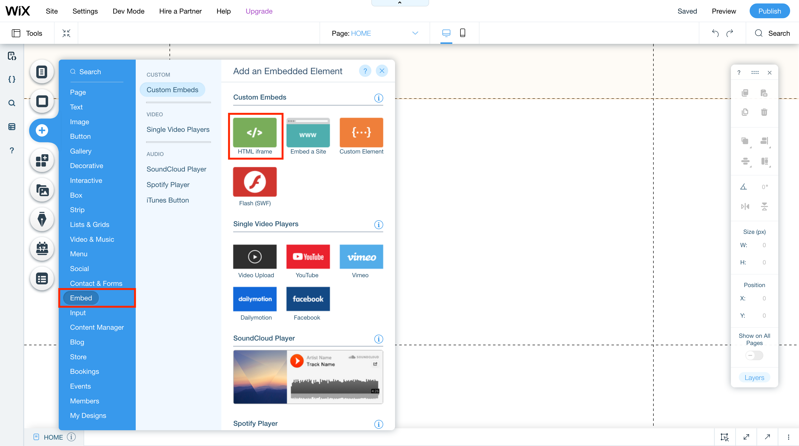
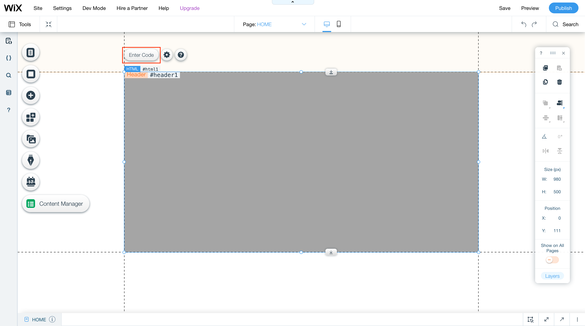
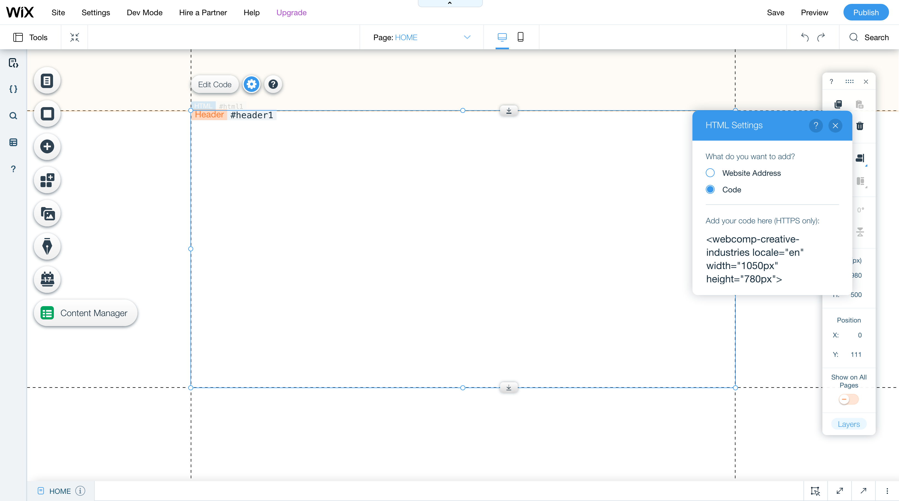

WIX
===

## Table of contents

- [Prerequisites](prerequisites)
- [How to add web components](how-to-add-web-components)

## Prerequisites

Adding Web Components to WIX is very straightforward. To follow this guide you will need a WIX account

## How to add web components

1. Login to your WIX account and create a new website. Alternatively you can use an existing one. In this guide we use a new one with an empty template.

2. Once the editor has loaded you can add a new component from the left side menu.
   
   

3. Click on embed in the menu and select the HTML iframe component from the list
   
   

4. Fit the iframe component to the desired size and click on "Enter Code"
   
   

5. Paste the snippet of the web component into the text field and you are done.
   
   

Alternatively you can also use a "Custom Element". However, this component is not included in the free plan.
