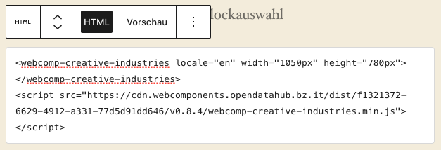

<!--
SPDX-FileCopyrightText: NOI Techpark <digital@noi.bz.it>

SPDX-License-Identifier: CC0-1.0
-->

Wordpress
=======

## Table of contents
- [Local setup with Docker](local-setup-with-docker)
- [How to add a web-component](how-to-add-a-web-component)

## Local setup with Docker

The project conains a docker compose file that will setup a fresh wordpress instance.

```sh
docker-compose up -d
```

To see the running wordpress installation click on the link below:

http://localhost:8080

## How to add a web-component

Wordpress supports different ways to add a webcomponent.

### HTML block

Insert an **HTML** block into the desired page and paste the webcomponent code into this block.



By clicking on preview you will be able to see the rendered web component.
